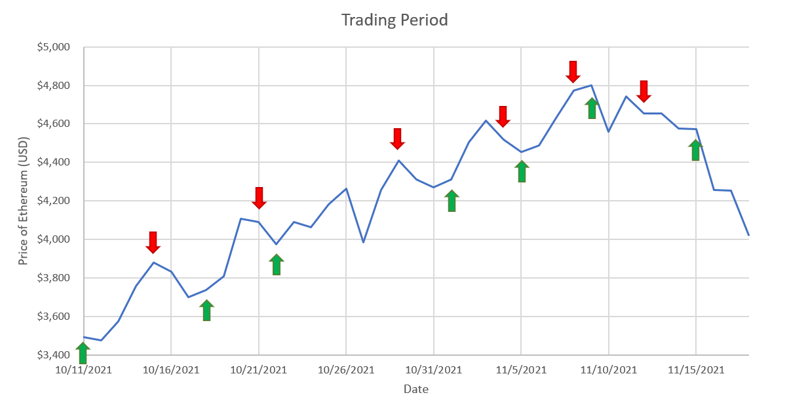

<!-- knitr global options -->
```{r, include = FALSE}
knitr::opts_chunk$set(comment = NA, fig.width = 8, fig.height = 8, fig.align = 'center')
```

\pagebreak

# Introduction

Developments in the digital world have reconstructed the contexts in which humans perceive value, particularly with the creation of cryptocurrency. Cryptocurrency has become a frequently discussed topic in economics due to its status as the digital alternative to central bank-controlled fiat money. As more businesses begin to accept various cryptocurrencies for payment, its entryway into other industries is inevitable.

Cryptocurrencies use a distributed ledger system shared among nodes of a blockchain network to secure its transactions. This peer-to-peer network validates and clusters information on each transaction in components called “blocks.” Each block is continuously closed and linked to previously filled blocks, creating a chain that acts as a public database. This design is inherently irreversible in that each block cannot be re-recorded after its close, and decentralized, in that all users of the system maintain equal ownership of it. These two qualities make blockchain hacking exceedingly difficult as new copies of the chain are created for every new block added, meaning any chain containing altered information may easily be distinguished among the identical group and be deemed invalid. Due to the security, privacy and convenience provided by blockchain technology, cryptocurrency has become a popular investment choice for businesses and consumers alike.

The most popularly exchanged and highly valued cryptocurrency is Bitcoin (BTC), based on the blockchain network that was launched in 2009 in the wake of the global financial crisis. BTC’s blockchain purely exists as a means to exchange digital currency. Its massive and timely success signaled to creators that its underlying innovations could be utilized for other purposes. Such utilities are found in the Ethereum blockchain, created not only to maintain a digital payment network, but also to allow applications to be built, deployed and run without third-party interference. Its currency, Ether (ETH), powers online contractual agreement applications called smart contracts for a respective transaction cost, known as the gas price, paid to the miners that validate each transaction in the system. Ethereum rewards miners who append each block on the network and gives marginal rewards to those who validate a block slower than competitors, called uncle blocks. This issuance works differently for Ethereum than Bitcoin, which is issued diminishingly with a cap at 21 million BTC in contrast to ETH’s infinite ceiling. However, an improvement proposal was recently implemented that increases the base gas fee to burn a portion of every transaction, known as EIP-1559. With enough network activity, ETH could become a deflationary currency despite its positive rate of emissions today. 

Since August of 2021, a substantially large amount of ETH burned has been attributed to the sale of non-fungible tokens (NFTs), which are unique, authenticated digital files stored on the Ethereum blockchain. Such virtual assets are bought with ETH in smart contracts and change in value based on market demand. Other applications on Ethereum support the creation of wallets which are virtual containers for users to hold cryptocurrency and tokens, in addition to art marketplaces, decentralized finance platforms and social networks. These characteristics have garnered Ethereum significant interest since its inception, helping to make ETH hold the second highest market cap behind BTC.


# Research Question
With Ethereum’s increase in attention and common knowledge in recent years, much effort has been spent to predict and analyze future prices of ETH. Its price is especially difficult to forecast due to high volatility and lack of association with classical economic indicators, in addition to having its own blockchain-unique characteristics relating to gas, burning and issuance. This study attempts to determine the extent to which such external and internal factors influence changes in the price of ETH. External factors refer to market activity, such as the S&P 500, price of gold and silver, yields on the 1, 5, and 10-year treasuries, and industry-based indices, as well as the price of competitive coins, such as BTC and Litecoin (LTC). Internal factors evaluated include ETH created, number of transactions, and amount of gas used given in daily snapshots. Additionally, an association is drawn between the daily price of ETH and the number of times ETH and NFT are mentioned on Twitter with related words in a given day.

First, we will standardize our datasets into daily snapshots to obtain specific observations to use in our models. Then, we will run random forests to determine the significance of each of the collected fields' impact on the price of ETH. Once we have an understanding of how these variables explain ETH price in the past, we will attempt to predict its future price through further random forest models and create an algorithm that maximizes profits through buying, selling and holding based on its own prediction. Additionally, we will conduct a separate analysis to discover if Twitter data has a significant influence on ETH price changes.

Our findings suggest that the price change of ETH fluctuates similarly to the price of BTC and LTC, the first two cryptocurrencies ever deployed, and is also impacted by the energy and real estate sectors. When considering internal Ethereum blockchain-based variables, transaction count and percentage of gas used per day were found to be significant indicators of price movement. We then shift our attention to forecasting *tomorrow's* change in the price of Ethereum. We find that changes in the performance of the real estate and bond market preempts changes in the price of Ethereum. Our model successfully capitalizes on this information to develop a profitable trading strategy. The volatility of Twitter data on the sentiments of tweets containing references to ETH and NFTs is noticeably visually associated with changes in the price of ETH. However, we do not have enough evidence to indicate a causual relationship between the two variables.


# Literature Review

Although interest in cryptocurrencies and their future applications has only become widespread in recent years, there are a number of studies that have effectively utilized machine learning methods to predict the price movements of such tokens. The large majority of each study’s target variable is the price of the respective cryptocurrency under examination, while the feature variables used can be categorized as either external or internal factors. Generally, the external factors include macroeconomic data, such as S&P 500 index, Dow Jones 30 index, Crude Oil, and Gold, among others, as well as global currency ratios, such as EUR/USD, JPY/USD and GBP/USD. The internal factors refer to blockchain information, such as trading volume, average block size, hash rate of block, difficulty of block, and miners’ revenue, among others. In this section, the chronology of each paper relevant to our studies is summarized, specifically in regard to the regressors used and concluding remarks. 

During the initial cryptocurrency market boom in 2017, an empirical study was conducted by Jang and Lee to determine how to model and predict the logarithmic price of BTC. They collected macroeconomic data, BTC blockchain information, and global currency ratios, to create 10, 10, and 5 regressors respectively for their model. The researchers first used linear regression to estimate the price, but found issues with multicollinearity and non-normal distributions of logarithmic volatility in BTC. After determining that a linear analysis may not be appropriate for time-series data, the authors employed a Bayesian Neural Network (BNN) to forecast BTC prices. Artificial Neural Networks, although beyond the scope of this course, provide a nonlinear method to analyze complex time series data. The Bayesian version of this model intuitively uses Bayesian theory, in that it maximizes the value of the posterior, to perform non-linear regression. This version of the model produced the lowest RMSE and MAPE (.0069 and .0180, respectively), compared to the linear and SVM methods. Ultimately, the researchers concluded that all models could predict price movements to an extent, but BNN could best describe the volatility and price of Bitcoin. The analysis did not touch upon which input factors were more or less influential on the response of BTC price and volatility. 

A more recent study, published in September 2021 by Hamayel and Owada, expands the scope of currency analysis by attempting to predict the prices of BTC, ETH and LTC. The researchers strictly collected daily price data on all three cryptocurrencies between October 2020 and June 2021, including token prices at day-open, day-close, and the high and lows achieved for each day. Given the fact that no other input factors were taken into account, this study aimed to create a prediction and analysis-based model on the technical movements in price using three neural network-based machine learning models: Long Short-Term Memory (LSTM), Bidirectional LSTM (bi-LSTM), and Gated Recurrent Unit (GRU). The models were trained with 80% of the dataset, from January 2018 to October 2020, and tested on the remaining 20%, from October 2020 through June 2021. The authors concluded that the GRU outperformed the other algorithms and can be considered efficient and reliable for predictions of cryptocurrency prices. Although this study only considers price data, Hamayel and Owada mention their interest in investigating how tweets can have an effect on the price and trading volume of various cryptocurrencies, specifically using Natural Language Processing and sentiment analysis. 

Sebastiao and Godinho’s study from January 2021 provides direct application to this paper through its forecast of BTC, ETC, and LTC prices based on both trading and blockchain information. The researchers performed regression and classification analysis using linear and random forest models respectively, in addition to a support vector machine (SVM) model -- a supervised algorithm for non-linear applications. The regression analysis focuses on the model’s predictive power for the prices of each cryptocurrency, while the classification analysis produces a success rate of determining a buy or sell rating for each token. The findings conclude that random forests give a high ETH success rate (60%) for classification, while linear regression gives a slightly lower ETH success rate for regression (54.46%). Although the results for SVM are similar to these methods, this finding demonstrates that linear and random forests can be used effectively to predict movements in cryptocurrency. Additionally, the study evaluates specific trading strategies that could be used to beat the market based on the model predictions.

The most relevant study to this paper is based on the recent work of Kim, Bock, and Lee from November 2021. The study focuses on forecasting Ethereum prices based on 15 macroeconomic factors, 4 Ethereum-specific blockchain variables, as well as factors based on the blockchain information of other tokens, including 9 BTC variables, 9 LiteCoin (LTC) variables, and 9 Dashcoin (DASH) variables. Interpreting each of the groupings above as a single regressor, they ran both a stepwise analysis and secondary analysis, to thoroughly understand which factors are affecting ETH price. Additionally, the machine learning models ANN and SVM were both used in every model pairing. Ultimately, they found that including Ethereum information with macroeconomic factors significantly improved the models’ predictive performance for ETH prices. Additionally, they deduced that blockchain information on BTC was significantly related to ETH prices, while other currencies’ blockchain information was not statistically relevant. 

As mentioned, the cryptocurrency industry is an extremely new space, and although there are some studies that have attempted to predict the price movements of these coins, there are many facets of this question to still uncover. The primary goal of this study is to use macroeconomic factors and blockchain information similarly to how Kim, Bock, and Lee did in their recently published research. However, the methodology differs in that linear and random forest models will be utilized to analyze predictions through regression and classification, similar to how Sebastiao and Godinho conducted their model analysis. Furthermore, we would also like to fulfill Hamayel and Owada’s goal of completing NLP and sentiment analysis on Twitter data to analyze its impact on ETH price. 


# Data

To predict changes in the price of ETH, we use financial market data as well as data pertaining directly to activity on the Ethereum network. All financial data was downloaded from *MarketWatch.com*, which specializes in providing historic and real-time data on a broad category of markets and asset classes. These data include daily price levels for various cryptocurrencies, stock indices, fuels, and rare metals. To gauge current economic sentiment, we also collect data measuring the volatility of the S&P 500 as well as yields on short- and long-term treasury bonds. A full description of the financial data collected can be found in Table 1.

**Table 1:** Financial Market Data

| Name           | Description                                                    |
|----------------|----------------------------------------------------------------|
| ETH            | Price level of Ethereum                                        |
| BTC            | Price level of Bitcoin                                         |
| LTC            | Price level of Litecoin                                        |
| SPX            | Index tracking performance of S&P500                           |
| CBOEVolatility | Index measuring expectations of volatility in the stock market |
| SP500Energy    | Index tracking performance of major US energy companies        |
| DJRetail       | Index tracking performance of major US retailers               |
| DJRealEstate   | Index tracking performance of major US real estate companies   |
| ShanghaiComp   | Index tracking performance of the Shanghai Stock Exchange      |
| CrudeOil       | Price level of crude oil                                       |
| NaturalGas     | Price level of natural gas                                     |
| Gold           | Price level of gold                                            |
| Silver         | Price level of silver                                          |
| TY1M           | Yield on 1 Month US Treasury Bills                             |
| TY1Y           | Yield on 1 Year US Treasury Bills                              |
| TY10Y          | Yield on 10 Year US Treasury Notes                             |
| TY30Y          | Yield on 30 Year US Treasury Bonds                             |

To collect data pertaining to activity on the Ethereum network, we scraped data from each block via https://etherscan.io/blocks and aggregated it into daily snapshots. These snapshots include data on daily transaction counts, energy used to validate transactions, and amount of Ether created or burned. A full description of the data collected on the Ethereum network can be found in Table 2.

**Table 2:** Ethereum Network Data

| Name             | Description                                                                               |
|------------------|-------------------------------------------------------------------------------------------|
| txn_count        | Number of transactions on Ethereum network per day                                        |
| gas_used         | Amount of Ether paid to validators on the network per day                                 |
| gas_limit        | Maximum amount of Ether that could be paid to validators on the network per day           |
| eth_created      | Amount of Ethereum created or burned per day                                              |
| percent_gas_used | Amount of computational energy used divided by maximum amount available                   |

Note that all market data was collected at market close, or 4PM Eastern time. The price of each cryptocurrency was collected at 5PM Eastern time, and daily snapshots aggregate data from the 24-hour period leading up to 5PM EST. Thus, for any given day, our data represents the most recent data available as of 5PM.

To collect Twitter data, 12,296 tweets from November 3rd, 2021 to December 3rd, 2021 were extracted using two separate Twitter Developer Account with filters applied to solely obtain tweets written in English from “verified” accounts that contain the word “Ethereum” or “ETH”. Another 9,900 tweets that contain "NFT" were extracted from July 6th, 2021 to August 10th, 2021 using the same other parameters. Strictly “verified”  accounts were utilized to streamline the tweet collection process, while still allowing for an observable effect on the ETH Twitter community through such accounts’ large follower base. The ETH tweet dates were chosen at random for extraction, while the tweet dates for NFTs were chosen to correlate to a large surge in ETH price. Ethereum price data was extracted from *ethereumprice.org*, a reputable source that allows for free downloads of data on the price of ETH and associated cryptocurrencies.

```{r, echo = FALSE, message = FALSE, warning = FALSE, results = 'hide'}

rm(list = ls())
setwd("/Volumes/NO NAME/ProjectFolder")

library(tidyverse)
library(lubridate)
library(tree)
library(randomForest)
library(gbm)

# Load and compile market data

filenames = c('BTC', 'LTC', 'SPX', 'CBOEVolatility', 'SP500Energy', 'DJRetail',
              'DJRealEstate', 'ShenghaiComp', 'CrudeOil', 'NaturalGas', 'Gold',
              'Silver', 'TY1M', 'TY1Y', 'TY10Y', 'TY30Y')

MacroData = read_csv('ETH.csv') %>%
  select(-Open, -High, -Low) %>%
  setNames(c('Date', 'ETH'))

for (name in filenames) {
  filename = paste(name, '.csv', sep = '')
  data = read_csv(filename) %>%
    select(-Open, -High, -Low) %>%
    setNames(c("Date", name))
  MacroData = inner_join(MacroData, data, by = c('Date' = 'Date'))
  name
  nrow(MacroData)
}

MacroData = MacroData %>%
  mutate(Date = mdy(Date))

# Convert to percentages

n = nrow(MacroData)
m = ncol(MacroData)

MacroDataChange = MacroData
for (i in 1:(n-1)) {
  for (j in 2:m) {
    curr = MacroData[i, j]
    last = MacroData[i + 1, j]
    MacroDataChange[i, j] = (curr - last) / last
  }
}
MacroDataChange = slice(MacroDataChange, 1:(n-1))


# Load and compile data on ethereum network activity

ETHNetwork = read_csv('eth_snapshots_avg.csv') %>%
  mutate(timestamp = mdy(timestamp))

ETHData = read_csv('ETH.csv') %>%
  mutate(Date = mdy(Date)) %>%
  select(Date, Close) %>%
  inner_join(ETHNetwork, by = c('Date' = 'timestamp'))

# Convert to percentages

n = nrow(ETHData)
m = ncol(ETHData)

ETHDataChange = ETHData
for (i in 1:(n-1)) {
  for (j in 2:m) {
    curr = ETHData[i, j]
    last = ETHData[i + 1, j]
    ETHDataChange[i, j] = (curr - last) / last
  }
}
ETHDataChange = slice(ETHDataChange, 1:(n-1))

# Compile full data set with market data and ethereum network data

FullData = inner_join(MacroData, ETHNetwork, by = c('Date' = 'timestamp'))

# Convert to percentages

n = nrow(FullData)
m = ncol(FullData)

FullDataChange = FullData
for (i in 1:(n-1)) {
  for (j in 2:m) {
    curr = FullData[i, j]
    last = FullData[i + 1, j]
    FullDataChange[i, j] = (curr - last) / last
  }
}
FullDataChange = slice(FullDataChange, 1:(n-1))

```

\pagebreak

# Explanatory Models

## Methodology

In this section, we attempt to predict how the price of ETH changes over the course of a given day by using the most recent data from financial markets and the Ethereum network. To do this, we first represent all data as a percentage change from the previous day. Then, we use random forests to see whether changes in market conditions and changes in Ethereum blockchain usage over the past day can accurately predict how the price of ETH has changed over that period.

The random forest algorithm creates each decision tree by drawing $n$ observations with replacement from the dataset. As a result, certain observations are excluded from each tree, known as out-of-bag observations. To reduce the correlation between decision trees, only a fraction of the regressors are considered for each split. This increases the bias of our results but lowers the variance by creating trees that are less sensitive to a small number of strong predictors. We find the optimal number of regressors that should be considered for each split by minimizing the average out-of-bag test error.

## Financial Data Model

First, we attempt to predict the change in the price of ETH using only financial market data. As shown in the following chart, the price of competing cryptocurrencies as well as the performance of the energy and real estate markets are the most important variables for predicting the price of ETH. Using these variables and other market indicators, we are able to explain up to 65 percent of the variance in the price changes of ETH.

```{r, include = FALSE}
MacroDataChange = select(MacroDataChange, -Date)
X = model.matrix(ETH ~ ., MacroDataChange)[,-1]
Y = MacroDataChange$ETH

set.seed(123)
tuneRF(X, Y, ntreeTry = 500, improve = 0.001, 
       plot = TRUE, trace = TRUE, doBest = TRUE)
```

```{r, echo = FALSE, message = FALSE, warning = FALSE, results = FALSE}
FinancialModelRF = randomForest(X, Y, importance = TRUE, ntree = 500, mtry = 10)
varImpPlot(FinancialModelRF, n.var = 10)
```

To understand how these variables impact the price of ETH, below we have included a sample decision tree generated by the CART algorithm. Most notably, we see that the price of bitcoin and litecoin are strongly correlated with the price of ETH. BTC and LTC were the first two cryptocurrencies to enter into existence, BTC being deployed in 2009 and LTC in 2011, so it is no surprise that they represent the cryptocurrency market as a whole.

As we examine the tree further, we can see that the energy and natural gas markets also have a positive correlation with price movement in ETH. Cryptocurrency uses a lot of energy to keep alive, especially on networks that use a Proof of Work consensus mechanism that requires nodes on the network to compete with each other to solve an energy-consuming hashing problem. Ethereum is one of these networks, however, a future update to Ethereum will change the consensus mechanism to a Proof of Stake protocol where validators are randomly chosen to mine each block rather than competing for it. This drastically reduces the energy used to keep the network alive, so ETH will become a more cost effective alternative to BTC and other cryptocurrencies when energy costs are high.

Lastly, one can see that when the real estate market is down, ETH performs well. We suspect this is due to ETH being an alternative investment for those in the real estate industry. Also, a more speculative point to make is that real estate is making its way to the “metaverse” in the form of digital plots of land for various video games such as Sandbox and Decentraland which may take away from money otherwise spent in real estate since these plots are purchased using ETH. 

```{r, echo = FALSE, message = FALSE, warning = FALSE}
macroTree = tree(ETH ~ ., MacroDataChange)
plot(macroTree)
text(macroTree, cex = 0.7)
```

## Ethereum Network Data Model

Next, we attempt to predict price changes in ETH using only internal data from the Ethereum network. In order to reduce the volatility of these data points, we constructed rolling 3-day and 5-day averages, which have been labeled accordingly. As the charts below demonstrate, gas usage and transaction counts were important indicators for predicting ETH's change in price.

```{r, include = FALSE}
ETHDataChange = select(ETHDataChange, -Date)
X = model.matrix(Close ~ ., ETHDataChange)[,-1]
Y = ETHDataChange$Close

set.seed(123)
tuneRF(X, Y, ntreeTry = 500, improve = 0.001,
       plot = TRUE, trace = TRUE, doBest = TRUE)
```

```{r, echo = FALSE, message = FALSE, warning = FALSE, results = FALSE}
EthereumModelRF = randomForest(X, Y, importance = TRUE, ntree = 500, mtry = 5)
varImpPlot(EthereumModelRF, n.var = 5)
```

The purely internal model turned out to be not as helpful as we originally thought. As we can see from the sample decision tree, the model fits noise when txn_count < 0.072818 since it is very rare that daily change in ETH is greater than 44%. However, the model does help us pinpoint important fields for us to consider in the combined internal, external model: percent_gas_used5 and txn_count. 

When the percentage of gas used increases, the transactions on the network require more computing power and thus it will cost more additional money to complete a transaction. This is one of the major pitfalls of Ethereum right now: it’s too expensive to conduct low value transactions. For example, sending \$5 of ETH to your friend might cost you another \$80 just to pay the miners to validate your transaction. Thus, when the percentage of gas used increases, it makes sense that people would want to sell their ETH for cheaper alternatives or to get out of the market entirely.

```{r, echo = FALSE, message = FALSE, warning = FALSE}
ethTree = tree(Close ~ ., ETHDataChange)
ethTreePruned = prune.tree(ethTree, best = 6)

plot(ethTreePruned)
text(ethTreePruned, cex = 0.7)
```
Lastly, when network transactions increase, we can see a very obvious increase in the price and vice versa when network activity decreases. The graph below demonstrates this well.


## Combined Model

Finally, we use both datasets combined to predict changes in the price of Ethereum. Again, the performance of competing cryptocurrencies and the performance of the energy sector are important for predicting changes in the price of ethereum. However, we also see that factors internal to the ethereum network, such as the amount of gas used and the transaction count, are also important.

```{r, include = FALSE}
FullDataDates = FullDataChange
FullDataChange = select(FullDataChange, -Date)
X = model.matrix(ETH ~ ., FullDataChange)[,-1]
Y = FullDataChange$ETH

set.seed(123)
tuneRF(X, Y, ntreeTry = 500, improve = 0.001,
       plot = TRUE, trace = TRUE, doBest = TRUE)
```

```{r, echo = FALSE, message = FALSE, warning = FALSE, results = FALSE}
CombinedModelRF = randomForest(X, Y, importance = TRUE, ntree = 500, mtry = 20)
varImpPlot(CombinedModelRF, n.var = 10)
```


\pagebreak

# Predicting Tomorrow's Ethereum Price

## Methodology

In the previous section, we found that changes in the price of other cryptocurrencies and changes in the performance of the energy and real estate markets were useful variables for explaining changes in the price of ETH. While these models are useful for explaining what drives the price of ETH, they provide little guidance on predicting ETH's future price. In this section, we turn out attention towards forecasting *tomorrow's* ETH price.

To do this, we construct a new Bernoulli variable 'Buy' which evaluates to one if the price of ETH increases by more than one percent the following day. For example, if ETH is trading at \$1,000 Monday at 5PM and increases to \$1,020 by Tuesday at 5PM, this indicates we should have bought ETH on Monday. For our Monday observation, 'Buy' evaluates to 1.

Using gradient boosting, we attempt to classify each day as 'Buy' or 'Not Buy' using the most recent data from financial markets and the Ethereum network. We use data from January 2021 through September 2021 in order to train our gradient boosting algorithm, and then test the model on data from October through November. In this sense, we can imagine ourselves as investors sitting at the end of September, looking to create a model using past historical data that we can use to forecast prices moving forward.

To create our gradient boosting algorithm, we must optimize over three separate tuning parameters: learning rate, individual tree size, and total number of sequential trees. To do this, we select values for the learning rate and tree size and find the number of trees that minimizes the test MSE of our model. We repeat this process for many possible learning rates and tree sizes and choose the parameters that result in the lowest possible test MSE. Finally, we use these optimal parameters and train the model with the entire set of data from January through September, giving us our final model.

```{r, include = FALSE}
library(gbm)

# Compute 'Buy' variable
alpha = 0.01
n = nrow(FullDataChange)
TradingData = add_column(FullDataChange, Buy = 0)
for (i in 2:n) {
  TradingData$Buy[i] = case_when(
    FullDataChange$ETH[i-1] > alpha ~ 1,
    TRUE ~ 0)
}

# Test data from October thru November
# Train data from January thru September
testData = TradingData %>%
  select(-ETH) %>%
  slice(2:28)
trainData = TradingData %>%
  select(-ETH) %>%
  slice(29:186)

# Perform gradient boosting; optimize over three tuning parameters
hypergrid = expand.grid(
  shrinkage = c(0.005, 0.01, 0.1),
  interaction.depth = c(1, 2, 3, 4, 5),
  optimal_trees = 0,
  min_deviance = 0
)

set.seed(1)
for (i in 1:nrow(hypergrid)) {
  gbm.tune = gbm(Buy ~ .,
                 data = trainData,
                 distribution = "bernoulli",
                 n.trees = 100,
                 interaction.depth = hypergrid$interaction.depth[i],
                 shrinkage = hypergrid$shrinkage[i],
                 cv.folds = 5,
                 n.cores = NULL,
                 verbose = FALSE)
  hypergrid$optimal_trees[i] = which.min(gbm.tune$cv.error)
  hypergrid$min_deviance[i] = min(gbm.tune$cv.error)
}

# Select best tuning parameters, train final model
optimal_setting = which.min(hypergrid$min_deviance)
gbm.best = gbm(Buy ~ .,
               data = trainData,
               distribution = "bernoulli",
               n.trees = 100,
               interaction.depth = hypergrid$interaction.depth[optimal_setting],
               shrinkage = hypergrid$shrinkage[optimal_setting],
               cv.folds = 5,
               n.cores = NULL,
               verbose = FALSE)
min_error = which.min(gbm.best$cv.error)

# Testing model on October and November data
trades = predict.gbm(gbm.best, newdata = testData, n.trees = min_error, type = "response")

tradingPeriod = FullDataDates %>%
  slice(1:27) %>%
  select(Date, ETH) %>%
  add_column(hadBought = trades) %>%
  mutate(hadBought = if_else(hadBought > 0.5, 1, 0)) %>%
  mutate(dailyProfit = if_else(hadBought == 1, 100 * ETH, 0))
tradingPeriod

## Trading profits:
profits = sum(tradingPeriod$dailyProfit)

```

## Results

Using the model developed with the methodology described above, we are able to predict the change in ETH's price tomorrow using market data from today. To evaluate the performance of our model, we define the following trading strategy:

1) At market close (5PM), feed the model data from the past 24 hours. This includes financial market data and a summary of daily activity over the Ethereum network.

2) The model will return the probability that today is a 'Buy' day. If the probability is greater than 50 percent, purchase $100 worth of ETH at its 5PM price, and sell your holdings tomorrow at 5PM. If the probability is less than 50 percent, do nothing.

3) Repeat the process tomorrow at 5PM.

Using this procedure, we calculate our earnings and losses for each day. Over the entirety of October and November, this trading strategy results in a profit of $26. The following figures illustrates the decisions of the model over the course of October and November (note that market data from China was not available during the beginning of October, hence the starting date of October 11). Green arrows indicate the beginning of a 'Buy' period, and red arrows indicate the beginning of 'Hold' periods, where the model recommends not trading. As we can see, the model performed well over the course of October when ETH experienced fairly steady gains. Over this period, the model successfully sent 'Buy' signals when the price was rising and accurately forecasted price declines. However, the model performed poorly towards the end of November, where markets were generally troubled by worrisome job reports. Also in November, the Securities and Exchange Commission rejected a proposal for a BTC exchange traded fund, causing falls in the price of many cryptocurrencies. With that said, given our strategy of only investing \$100 each day, the losses in November were limited, and our model was able to deliver a positive net return of \$26.



Finally, to understand what factors were driving the the trading decisions of our model, we plot the relative importance of each variable to the gradient boosting model. We find that that the performance of the real estate market as well as changes in long-term yields were the most important variables driving the decisions of our trading algorithm. This provides further support for the idea that ETH serves as an alternative investment when traditional markets such as real estate are performing poorly. As for interest rates, large proponents for cryptocurrency, such as Elon Musk, have suggested that historically low interest rates set by the Federal Reserve Bank have driven demand for cryptocurrency. In a low-interest rate environment, investors are likely to seek out higher-risk securities like cryptocurrency that offer a higher yield. However, it appears there is a short delay between these changing market conditions and changes in the price of ETH, and our model appears to be capitalizing on this delay.

**Table 3:** Relative Importance of Variables in Trading Algorithm
```{r, echo = FALSE, message = FALSE, warning = FALSE, results = FALSE}
summary(gbm.best, cBars = 5)
```

# Twitter Data Analysis
We conducted an additional analysis for our report to understand how data on Twitter is correlated with the price of ETH, and if any sensible conclusions may be determined from these results.

In order to find the words most associated with ETH, we created a corpus on the textual data contained in each tweet and a data-frame matrix as the foundation for our frequency plot. We find that, barring “ETH” and “ethereum”, the most common words in the tweets include “crypto”, “bitcoin”, “now”, and “nft”. As observable from conclusions drawn with the preceding models, changes in BTC price have an effect on the price of ETH as supported by this textual analysis. However, the meaning of the terms “now” and “nft” have yet to be explored in this analysis and the previous literature reviewed.
```{r, echo=FALSE, results=FALSE, message=FALSE, warning=FALSE}
library('lubridate')
library('patchwork')
library('quanteda')
library('quanteda.textplots')
library('quanteda.textmodels')
library('quanteda.textstats')
library('tidytext')
library("tidyverse")
library("ggplot2")
library("topicmodels")
library("zoo")
library("wordcloud")

tweets <- as.tibble(read.csv('/Users/ajfinky/Desktop/ECON 224/Data/tweets_NFT_final.csv'))
tweets30 <- as.tibble(read.csv('/Users/ajfinky/Desktop/ECON 224/Data/tweets_ETH_final.csv'))
etherPrices <- as.tibble(read.csv('/Users/ajfinky/Desktop/ECON 224/Data/etherprices.csv'))

etherPrices = etherPrices %>% 
  mutate(Date = as.Date(Date, "%m/%d/%Y"))
etherPrices = etherPrices %>% 
  mutate(day = day(Date), month = month(Date)) %>%
  select(-Volume)

tweets = tweets %>%
  mutate(text = as.character(text)) %>%
  filter(na.omit = TRUE)

tweets$text = str_remove_all(tweets$text,"(#|@)[A-Za-z0-9_]+")

tweets = tweets %>%
  mutate(year = year(created_at),
         month = month(created_at),
         day = day(created_at)) %>%
  select(user_id, screen_name, created_at, year, month, day, text)

tweets30 = tweets30 %>%
  mutate(text = as.character(text)) %>%
  filter(na.omit = TRUE)

tweets30$text = str_remove_all(tweets30$text,"(#|@)[A-Za-z0-9_]+")

tweets30 = tweets30 %>%
  mutate(year = year(created_at),
         month = month(created_at),
         day = day(created_at)) %>%
  select(user_id, screen_name, created_at, year, month, day, text)

corpus_tweets30 <- corpus(tweets30$text,
                       docvars = tweets30[,c('screen_name', 'year', 'month', 'day')])
sentiments = get_sentiments("bing")

sentiment_dictionary = dictionary(list(positive = sentiments[sentiments$sentiment == 'positive',]$word, 
                                        negative = sentiments[sentiments$sentiment == 'negative',]$word))
corpus_tweets30 <- corpus_tweets30 %>%
  tokens(remove_punct = TRUE, remove_numbers = TRUE,
         remove_symbols = TRUE, remove_url = TRUE) %>%
  tokens_remove(stopwords("en"), padding = TRUE) %>%
  tokens_wordstem("en") %>%
  tokens_ngrams(n = 1:2) %>%
  tokens_tolower()

tweets30_sentiment_dfm = tokens(corpus_tweets30) %>%
  tokens_lookup(dictionary = sentiment_dictionary) %>%
  dfm()

tweets30_dfm = dfm(tokens(corpus_tweets30)) %>% 
  dfm_trim(min_termfreq = 10)

freq30 = textstat_frequency(tweets30_dfm, 17)
freq30 = freq30[-1:-2]
plot_freq30 = ggplot(freq30, aes(x=feature,y=frequency,, fill = ifelse(feature == "nft",
                                                                       "highlighted",
                                                                       "Normal"))) +
                      geom_bar(stat = 'identity') +
  ggtitle("Words Frequently Associated with ETH") +
  labs(x = "Top 15 Most Frequent Words",
       y = "Number of Times Used") +
  theme(text = element_text(size = 10),
        axis.text.x = element_text(angle=90, hjust=1),
        legend.position = "none")
plot_freq30
```
To understand the results above, further analysis was conducted using sentiment data. Each word within the tweets was assigned a “positive” or “negative” connotation from a sentiment dictionary included in R. After aggregating the scores for all the words in each tweet and adding the scores, the daily sentiment data on tweets including “ETH” was calculated. The results most clearly displayed that these tweets contained more positive sentiments than negative sentiments throughout the data collection period, by an average margin of approximately 50%. This feature could potentially be attributed to the fact that only “verified” users’ tweets were collected for analysis. Many “verified” accounts are associated with businesses and are therefore more likely to be promotional in nature than degrading. Also, the considerable hype surrounding ETH and other cryptocurrencies at the time of collection would presumably create more positivity than negativity in consumers' sentiments in general.
```{r, echo=FALSE, results=FALSE, message=FALSE, warning=FALSE}
metadata30 = tweets30_dfm@docvars
sentiment30_df = convert(tweets30_sentiment_dfm,
                             to = 'data.frame')
tweets30_full_df = full_join(metadata30, sentiment30_df,
                            by = c('docid_'='doc_id'))

etherPrices1 = etherPrices[(etherPrices$Date >= "2021-11-03" & etherPrices$Date <= "2021-12-03"),]

plotETH1 = ggplot(etherPrices1, mapping = aes(x = Date, y = Close.Last)) +
  geom_line() +
  ggtitle("Price of ETH") +
  labs(x = "Date",
       y = "Price of ETH (USD)") +
  theme(text = element_text(size = 10))

sentiments30 = tweets30_full_df %>%
  group_by(month, day) %>%
  summarize(positivity = sum(positive),
            negativity = sum(negative))
sentiments30 = sentiments30[-32,]

sentiments30 = cbind(sentiments30, Dates = rev(as.Date(etherPrices1$Date)))
  
sentiment30_plot = ggplot(sentiments30, aes(x = Dates)) +
  geom_line(aes(x = Dates, y = positivity, color = 'Positive')) +
  geom_line(aes(x = Dates, y = negativity, color = 'Negative')) +
  ggtitle("Daily ETH Tweet Sentiment") +
  labs(x = "Date",
       y = "Sentiment Word Frequency") +
  theme(text = element_text(size = 10))

sentiment30_plot + plotETH1
```
More insightful results can be seen with the tweet sentiments’ relation to the price of ETH in the same period. Both positive and negative sentiments appear to be largely associated with given spikes or declines in ETH price. For example, the increase in price to $4800 on November 8th is in sync with significant increase in both positive and negative sentiments on the same day. The crash in price that occurred after on November 14th was quickly followed by a large reduction in positive sentiments and a smaller reduction in negative sentiments. This trend similarly occurs following the ETH boom at the end of November. The term “now” observed in our frequency plot above can be interpreted as a call to take action on ETH at a particular instant, which supports the reactionary trend present in the data. Additionally, the substantial variability of positive sentiment may indicate that “verified” users are more likely to tweet positively about ETH in boom periods and not exhibit any sentiment when the price begins to decline. This could potentially be due to a substantial increase in positive headlines concerning ETH in times of boom, which in turn creates similar sentiment through replies. This follows the general reactionary thesis, as such tweets and conversation would naturally follow any metrics observed in previous days.

Although there are many factors not immediately observable in this analysis, there is some evidence to suggest a relationship between ETH sentiment identified in tweets and the price of ETH during the same day. Higher frequency data measured in smaller units of time such as hours or minute intervals could be more helpful in drawing a causal relationship between these two variables.
```{r, echo=FALSE, results=FALSE, message=FALSE, warning=FALSE}
etherPrices2 = etherPrices[(etherPrices$Date >= "2021-07-06" & etherPrices$Date <= "2021-08-10"),]

plotETH2 = ggplot(etherPrices2, mapping = aes(x = Date, y = Close.Last)) +
  geom_line() +
  ggtitle("Price of ETH") +
  labs(x = "Date",
       y = "Price of ETH (USD)") +
  theme(text = element_text(size = 10))

tweetsPerDay = tweets %>%
  group_by(month, day) %>%
  summarize(tweetsPerDay1 = n())
Dates = rev(as.Date(etherPrices2$Date))
tweetsPerDay = cbind(tweetsPerDay, Dates = Dates)

plotDay = ggplot(tweetsPerDay, mapping = aes(x = Dates, y = tweetsPerDay1)) +
  geom_line() +
  ggtitle("Number of NFT Tweets per Day") +
  labs(x = "Date",
       y = "Number of Tweets") +
  theme(text = element_text(size = 10)) +
  scale_y_continuous()

plotDay + plotETH2
```
To explore how NFTs are associated with the price of Ethereum, Twitter data was collected for a period of 34 days (July 6 - August 10, 2021) in which the ETH price displayed a significant incline. Filters were similarly applied for English tweets from “verified” accounts, but this time “NFT” was used as a keyword and “giveaways” were removed from the data. This ensured that promotional spam was not included in the limited supply of tweets, due to its significant presence on Twitter and relative unlikelihood of affecting ETH price. After cleaning the data, the number of NFT tweets per day was plotted against the price of ETH, along with a sentiment analysis. The number of NFT tweets appears to be extremely volatile, moving through four distinguishable cycles with lows of 150 to highs of 400 NFT tweets per day. Demonstrating no significant association with the price of ETH, the number of NFT tweets per day seems to be influenced by other factors; perhaps the specific day of the week has an effect on tweet volume, with more users having time to tweet and buy NFTs on weekends. 

In contrast, the change in sentiment data on NFTs suggests that it is closely associated with the price of ETH, in that a positive increase in the price of ETH is followed by a rise in the positive sentiment of NFT tweets, with the same occurring for negative cases. This follows a similar, more volatile pattern to the reactionary trend observable in the sentiment analysis on ETH. Even a slight increase or decrease in the price of ETH may be followed by widely changing sentiments, as observed on July 14th and 22nd. The higher volatility can potentially be explained by NFT Twitter data occurring in smaller magnitudes than ETH Twitter data in a similar time range. The large disparity between the number of positive sentiment tweets and negative sentiment tweets may similarly be attributed to the fact that only "verified" users were included in the dataset. The sentiment concerning NFTs is largely positive in the Twitter community due to its widespread presence in today's pop culture and large market capitalization. It is not abnormal to assume that many users are aware of the futuristic and important capabilities of NFTs today and in the future.  
```{r, echo=FALSE, results=FALSE, message=FALSE, warning=FALSE}
corpus_tweets <- corpus(tweets$text,
                       docvars = tweets[,c('screen_name', 'year', 'month', 'day')])
sentiments = get_sentiments("bing")

sentiment_dictionary = dictionary(list(positive = sentiments[sentiments$sentiment == 'positive',]$word, 
                                        negative = sentiments[sentiments$sentiment == 'negative',]$word))

tweets_sentiment_dfm = tokens(corpus_tweets) %>%
  tokens_lookup(dictionary = sentiment_dictionary) %>%
  dfm()

corpus_tweets = corpus_tweets %>%
  tokens(remove_punct = TRUE, remove_numbers = TRUE,
         remove_symbols = TRUE, remove_url = TRUE) %>%
  tokens_remove(stopwords("en"), padding = TRUE) %>%
  tokens_wordstem("en") %>%
  tokens_ngrams(n = 1:2) %>%
  tokens_tolower()

tweets_dfm = dfm(corpus_tweets) %>% 
  dfm_trim(min_termfreq = 5)

metadata = tweets_dfm@docvars
sentiment_df = convert(tweets_sentiment_dfm,
                             to = 'data.frame')

tweets_full_df = full_join(metadata, sentiment_df,
                            by = c('docid_'='doc_id'))
sentiments = tweets_full_df %>%
  group_by(month, day) %>%
  summarize(positivity = sum(positive),
            negativity = sum(negative))
sentiments = cbind(sentiments, Dates = Dates)

sentiment_plot = ggplot(sentiments, aes(x = Dates)) +
  geom_line(aes(x = Dates, y = positivity, color = 'Positive')) +
  geom_line(aes(x = Dates, y = negativity, color = 'Negative')) +
  ggtitle("Daily NFT Tweet Sentiment") +
  labs(x = "Date",
       y = "Sentiment Word Frequency") +
  theme(text = element_text(size = 10))
sentiment_plot + plotETH2
```
Ultimately, the results imply an association between the price of ETH and NFT sentiment, supporting the frequency plot’s results that the term “nft” is important to ETH. Similar to the ETH data above, NFTs’ newfound popularity on social media platforms and unique qualitative application to the Ethereum blockchain could be valid reasons for associating this topic to future ETH price changes, especially as its market size continues to grow in time.

## Conclusion

In this report, we attempt to predict changes in the price of ETH using financial market data and data directly related to activity on the Ethereum network. Our results indicate that the performance of competing coins like BTC and LTC, as well as the performance of the US energy and real estate markets, explain a large portion of the variance in the price changes of ETH. These results indicate that the price of Ethereum is largely driven by the same factors that affect the prices of BTC and other cryptocurrencies, such as uncertainty over the regulatory landscape in the cryptocurrency space as well as fears over the volatility of these currencies. With that said, Ethereum stands out for its potential to drastically reduce the amount of energy needed to support its network, making it a popular investment choice when energy costs are high or other traditional investment spaces like real estate are underperforming. When it comes to forecasting tomorrow's price of Ethereum, we find that performance in the real estate and bond markets actually preempts changes in Ethereum's price. We speculate that falling yields in the bond market drive investors to more speculative assets such as Ethereum. Due to a slight lag between these two events, we are able to develop a successful trading algorithm that appears to accurately predict when the price of Ethereum is likely to increase. However, we are limited by a small dataset and are unable to test how reliable this trading strategy is over a prolonged period. Research into how public sentiment and investors' views of Ethereum change under different market scenarios provides a fruitful avenue for future exploration.

\pagebreak

## Bibliography
H. Jang; Jaewook Lee, "An Empirical Study on Modeling and Prediction of Bitcoin Prices With Bayesian Neural Networks Based on Blockchain Information." *The Institute of Electrical and Electronics Engineers* (2018)

M.J.Hamayel; A.Y. Owda, "A Novel Cryptocurrency Price Prediction Model Using GRU, LSTM and bi-LSTM Machine Learning Algorithms." *AI* (2021)

Helder Sebastião; Pedro Godinho, "Forecasting and trading cryptocurrencies with machine learning under changing market conditions." *Financial Innovation, Springer;Southwestern University of Finance and Economics* (2021)

Myeong Jun Kim; Nguyen Phuc Canh; Sung Y. Park, "Causal relationship among cryptocurrencies: A conditional quantile approach." *Finance Research Letters* (2020)

\pagebreak
## Acknowledgements
Alexander Nikolov extracted data on the financial markets, created the explanatory model and trading algorithm, wrote the conclusion, and provided input and edits to all facets of the project

Caleb Shack extracted the Ethereum blockchain-based data, created the explanatory model and provided input and edits to all facets of the project

Brandon Cohen wrote the literature review, extracted Twitter Data, created the sentiment analysis and provided input and edits to all facets of the project

Aaron Finkelstein wrote the introduction, extracted Twitter Data, created the sentiment analysis, assembled the final document and provided input and edits to all facets of the project